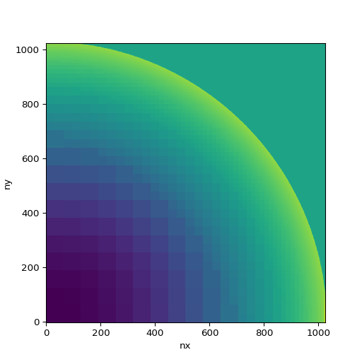

# Running a parallel job on `adroit`

We now describe how to run a parallel jon on the `adroit` cluster. First we need to compile our code using the MPI library. For this, go back in the `ramses/bin` directory and type:
```
$ module load openmpi/gcc/4.1.0
$ make clean
$ make NDIM=2 MPI=1
```
This will produce the executable `ramses2d` that we will launch using the MPI runtime environement.

For this, type:
```
$ cd ..
$ srun -n 8 -t 00:10:00 bin/ramses2d namelist/sedov2d.nml > run.log
```
This should have produced two new directories called `output_00001` and `output_00002`. These are called _snapshots_ as they contain the fluid data at the initial time and at the final time. We will now visualize the final snapshot using a combination of tools.

First, type in the Terminal window:
```
./utils/f90/amr2map -inp output_00002 -out dens.map -typ 1
```
This produces a map stored in the binary file `dens.map`. Then type (you need `anaconda` to be properly loaded for this):
```
./utils/py/map2img.py dens.map --log --out dens.png
```
This produces the following `dens.png` image of the density field at the final time of the simulation.



We will now learn out to submit a job to the job queue on `adroit`. First thing is to write a job script. Edit a file called `job.sh` with the following text inside:
```
#!/bin/bash -l
#SBATCH --job-name=sedov2d
#SBATCH --time=00:01:00
#SBATCH --nodes=1
#SBATCH --ntasks=8
module load openmpi/gcc/4.1.0
export DATE=`date +%F_%Hh%M`
cd ~/ramses
srun bin/ramses2d namelist/sedov2d.nml > run_$DATE.log
```
You can submit this job using:
```
$ sbatch job.sh
```
It produces the same simulation as before but not interactively anymore but after it goes through the job queue.

You can see
if the job is running using:
```
$ squeue -u your_login_name
```
Now let's try to make a movie of this simulation. For this, first edit the namelist file `namelist/sedov2d.nml` to change the output frequency by adding the following block:
```
&OUTPUT_PARAMS
tend=1.0
delta_tout=0.01
/
```
You can resubmit the job script. You will now get 101 snapshots instead of only 2.

Create a bash script called `movie.sh` with the following text inside:
```
#!/bin/bash
for i in `ls -d output_00*`
do
    echo $i
    ./utils/f90/amr2map -inp $i -out dens.map -typ 1 -fil ascii -lma 8
    gnuplot -e "set term jpeg; set palette rgbformulae 22,13,-31; set pm3d map; set size square; set cbrange [0:7]; splot 'dens.map' u 1:2:3 notitle" > pic_$i.jpeg
done
echo "converting to animated gif"
convert -delay 1 pic_output_00* movie.gif
rm -rf pic_output_00*
```
You have to transform this script into an executable using the command:
```
$ chmod a+x movie.sh
```
and then execute it:
```
$ ./movie.sh
```
You should get this nice movie in a file called `movie.gif`:


For those of you who have some time left, you can install the `yt` package using:
```
$ pip3 install yt
```
and follow the instructions to load up a `RAMSES` dataset into a python Jupyter Notebook using the following [Web page](https://yt-project.org). 

Try and visualize the same snapshots using `yt`. This visualization package is quite powerful and can read a lot of different simulation data format as explained in [this page](https://yt-project.org/doc/examining/loading_data.html?highlight=ramses).